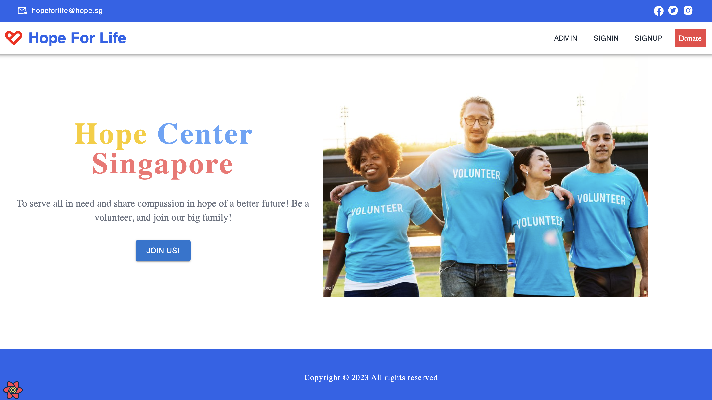
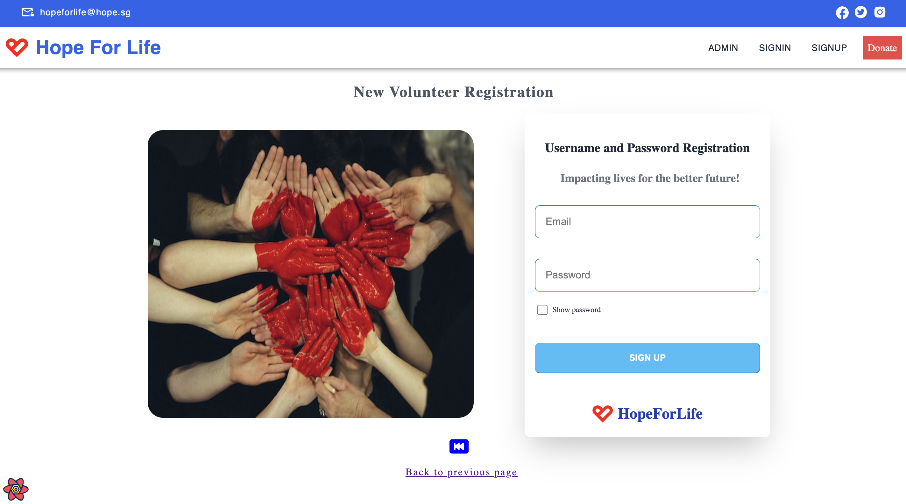
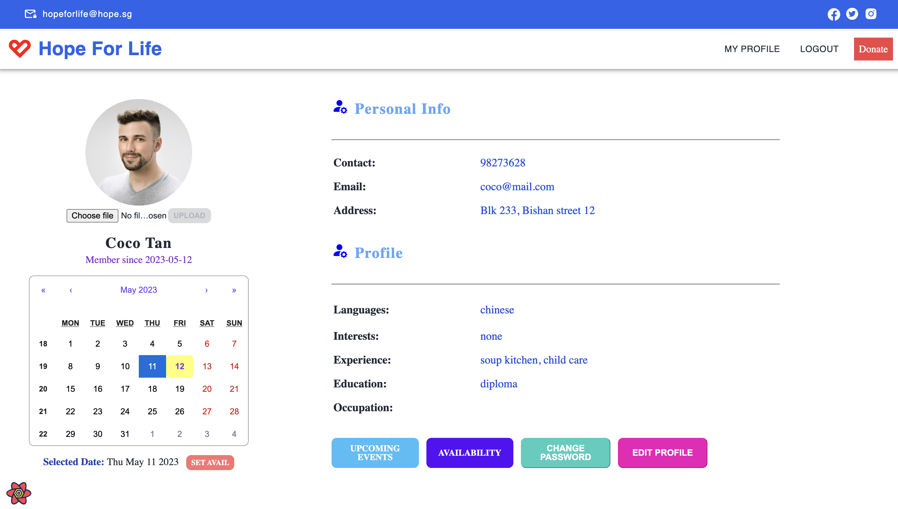
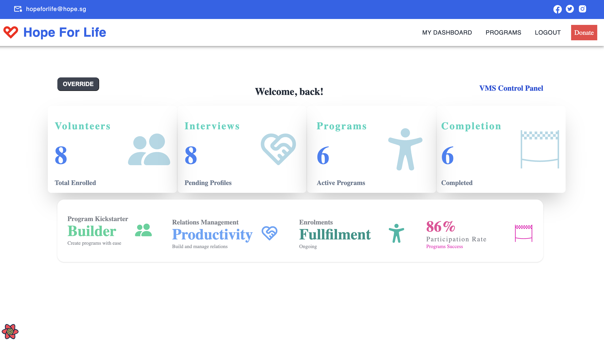
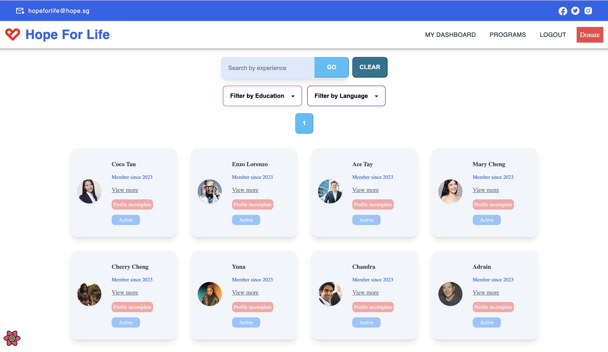
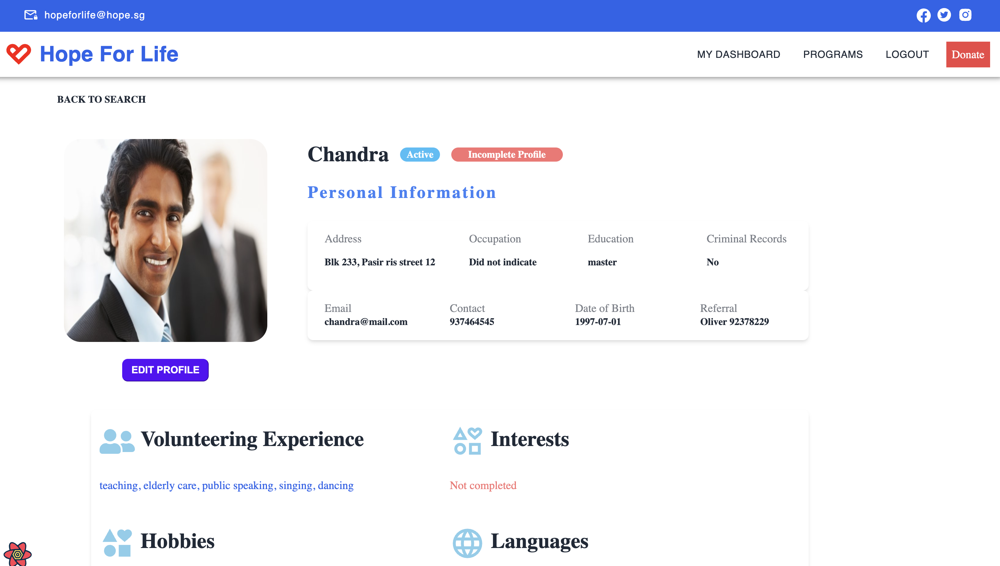
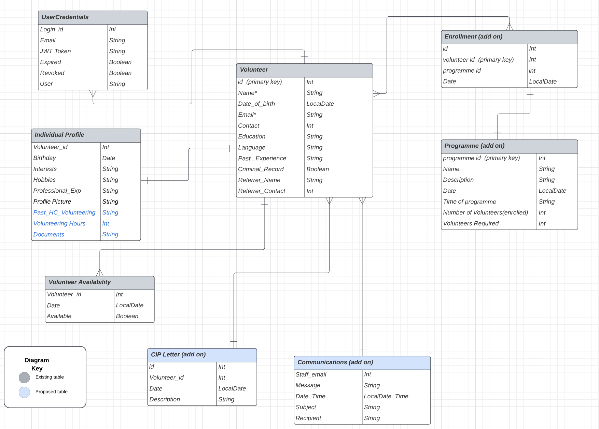
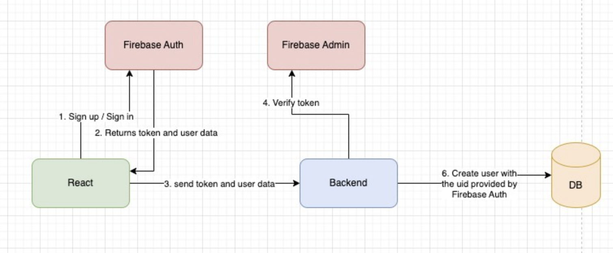

## Steps to start app in test environment
1. RUN < [docker run -p 8080:8080 goodwill80/vms-springboot:v1.0.1](#) > in command line to start backend server on port 8080. (PLEASE DO THIS FIRST!)
2. Go to https://illustrious-sopapillas-a57f5b.netlify.app

## Link to front-end (Demo)
Live Link coming soon!

## Description
### App Summary
1. A full-stack digital platform for new volunteer signups along with a CRM dashboard to enable staff to administer new programs and enrol new volunteers.
2. This is a pro-bono (proof-of-concept) project done to help a local charity organization to administer volunteers' signup, as well as manage its programs more efficiently. A simple process streamlining was performed to migrate some of the manual taskes commonly performed by staff to a digital platform.
3. Tech stacks - ReactJS with TypeScript, React Query, Tailwind CSS, Spring-Boot and Spring Security + Firebase Auth.
4. Deployment pipeline - GitHub, AWS code pipeline and AWS MySql RDS.
5. App in test environment (on port 8080) is using H2 in-memory database. 
6. For backend repository, refer to https://github.com/goodwill80/Volunteer_Management_System_VMS_Backend

## Screenshots (Proof-of-concept)

### Home Page:

### Volunteer Signup:

### Volunteer's Calendar and Scheduler:

### Admin Dashboard:

### Profile Search Page:

## Profile Page

### Relational Diagrams

### Authentication & Authorization Flow between front-end and backend
1. Firebase Auth for authentication and authorization.
2. Setup Security Filter Chain and Firbase filter to verify all requests which require JWT token.

## Team Members

- [Jonathan](https://github.com/goodwill80 "jonathan's github")
- [Ace](https://github.com/acetay "ace's github")
- [Yingwang](https://github.com/shiywsg "yingwang's github")
- [Claire](https://github.com/clairetkw "claire's github")
